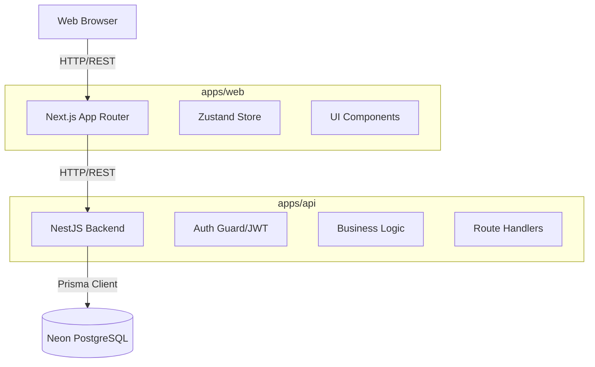

# Purpose
Defines the high-level technical architecture, system interactions, request lifecycles, and structural constraints for IFH One.

# Scope
Applies globally across the `ifh-one` monorepo.

# Last Generated
2026-07-01

# Related Documents
- [TECH_STACK.md](./TECH_STACK.md)
- [API.md](./API.md)
- [DATABASE.md](./DATABASE.md)

---

## Architecture Style
IFH One follows a **Client-Server Architecture** deployed as a Decoupled Monolith, residing within a single Turborepo. The backend is a standard layered monolithic NestJS application, while the frontend is a React-based Next.js application utilizing Server-Side Rendering (SSR).

## System Overview Diagram

## Folder Organization
The project utilizes `npm workspaces` and `Turborepo` to divide responsibilities:

- **`apps/web`**: Next.js 16 frontend application.
- **`apps/api`**: NestJS 11 backend API.
- **`packages/config`**: Shared TypeScript and ESLint configurations.
- **`packages/ui`**: Shared UI component library.
- **`packages/types`**: Shared interfaces and DTO definitions.
- **`packages/utils`**: Shared helper functions.
- **`packages/database`**: (If decoupled) Prisma client generation.
- **`infrastructure/`**: Docker Compose files and Nginx setup for local deployments.

## Request Lifecycle
1. **Client Request:** A user interacts with the Next.js UI.
2. **Data Fetching:** The Next.js Server Component or Client Component (`react-query` / `axios`) sends a request to the NestJS API.
3. **Authentication:** The NestJS API intercepts the request via a global AuthGuard. It verifies the JWT token.
4. **Authorization:** The API checks Role-Based Access Control (RBAC) permissions using a RolesGuard.
5. **Controller:** The request reaches the Controller, which validates the DTO using `class-validator`.
6. **Service:** The Controller delegates business logic to the corresponding Service.
7. **Database:** The Service queries the Neon PostgreSQL database via Prisma ORM.
8. **Response:** The data is formatted and returned back up the chain to the client.

## Analytics & Reporting Architecture
The IFH One V1.3.1 Command Center relies on live PostgreSQL aggregations rather than cached or mock data.
- **Dynamic KPIs:** SLA Compliance and Average Lead Times are calculated dynamically by diffing stage timestamps and parsing delay metrics.
- **Prisma Aggregations:** Complex groupings (e.g. stage bottlenecks, vendor performance) utilize Prisma `groupBy` to ensure calculations happen at the database level rather than inside Node.js memory.

## Enterprise SKU Discovery Engine
Added in v1.3.1, the SKU Discovery Engine provides high-performance, intelligent search capabilities across 18,000+ items.
- **Search Ranking:** Uses custom PostgreSQL logic to rank exact matches > prefix matches > partial matches > fuzzy matches.
- **Fuzzy Search:** Powered by `pg_trgm` and `gin` indexes to handle typos (e.g. 'cemnt' -> 'cement').
- **Smart Suggestions:** Surfaces recently used, frequently used, and project-aware SKUs.
- **Analytics:** The `SearchAnalytics` service asynchronously tracks search queries, response times, and zero-result fallbacks without blocking the API response.
- **Zero-Result Recovery:** When exact/prefix/partial matches fail, the system falls back entirely to fuzzy matching and signals the frontend to render a "Did you mean..." UI.
- **Virtualization:** Enforces strict server-side limits (max 30 items) for typeahead, and paginated virtualized windows for the Items Explorer to prevent rendering thousands of rows.

## Module Architecture (NestJS)
Each business domain (Procurement, RFQ, Vendors, Users) is encapsulated in its own NestJS Module.
Each module strictly adheres to the standard 3-tier architecture:
- `*.controller.ts`: Handles HTTP routing and input validation.
- `*.service.ts`: Houses core business logic.
- `*.module.ts`: Wires dependencies together.

## Role-Based Access Control (Route-Level)
Introduced in v1.6.0: a global `RolesGuard` (`apps/api/src/auth/guards/roles.guard.ts`) runs after `JwtAuthGuard` as a second `APP_GUARD`. Routes opt in via `@Roles('SUPER_ADMIN', 'ADMIN', ...)` (`apps/api/src/auth/decorators/roles.decorator.ts`), which checks the caller's JWT-derived `roles` claim. Routes without `@Roles()` are unaffected (guard is a no-op). This complements the existing per-stage `WorkflowStagePermission` model without replacing it.

## Bulk Workflow Operations
The Procurement Engine supports bulk stage transitions (`POST /procurement/bulk-action/preview`, `POST /procurement/bulk-action`) that apply a single workflow action to many indents at once. Rather than a separate state machine, bulk operations reuse the private `resolveStageTransition()` method that single-record updates use — each selected record is independently evaluated, and only records for which the action is legally valid in their current stage are updated. Ineligible records are skipped with an explicit reason rather than failing the batch. Execution is batched (25 records per batch) and each record commits inside its own Prisma transaction, so a single record's failure cannot roll back others already applied. See [DATABASE.md](./DATABASE.md) for the `BulkOperation` audit model.

## Generic Stage Workspace Engine (Next.js)
Introduced in v1.10.0: every actionable procurement stage (1–22) renders through one shared component, `StageWorkspace` (`apps/web/src/components/workflow/generic/StageWorkspace.tsx`), instead of per-stage bespoke pages. Stage-unique behavior is expressed as a `StageConfig` object (`apps/web/src/lib/workflow/stage-config-types.ts`) — declaring stage-level fields, per-item columns, workflow actions, validation rules, and summary/KPI fields — with one config file per stage under `apps/web/src/lib/workflow/stage-configs/`. Each `[id]/page.tsx` route is a thin wrapper (`<StageWorkspace id={id} config={xConfig} backHref="..." />`). Editable field values persist through the existing `ProcurementStage.metadata` JSON column (via `performStageAction()`'s `metadata` parameter) — no dedicated schema per stage. Validation rules are pure `(context) => boolean` functions evaluated client-side against the record and entered values; the same `WorkflowQueuePage` list component used by every stage's queue page carries row selection and the bulk "Change Workflow Stage" modal.

## State Management (Next.js)
- **Server State:** Handled by Next.js App Router (RSC) and React Query (`@tanstack/react-query`).
- **Client/Global State:** Managed via Zustand for lightweight, cross-component state synchronization (e.g., active user sessions, UI toggles).
- **Form State:** Managed via React Hook Form and Zod schema validation.

## Shared Modules
To prevent code duplication, `apps/web` and `apps/api` both consume types from `packages/types`. This guarantees that the API response shapes precisely match the frontend's expected data models.

## Performance Considerations
- **N+1 Queries:** Prisma is optimized to use `include` for eager loading related entities in a single query.
- **Pagination:** All list endpoints implement server-side pagination (`skip`, `take`) by default to prevent memory exhaustion on large tables.
- **SSR Optimization:** The Next.js frontend fetches initial critical data on the server, sending fully rendered HTML to the client for faster First Contentful Paint (FCP).

## Scalability Considerations
- The API is stateless (JWT based), allowing it to be horizontally scaled behind a load balancer without session stickiness.
- The PostgreSQL database is hosted on Neon, allowing for seamless serverless scaling and read replicas if required.

## Architectural Decisions & Tradeoffs
- **NestJS over Express:** Chosen for its opinionated structure, Dependency Injection, and TypeScript-first approach, sacrificing boilerplate speed for long-term maintainability.
- **Prisma over TypeORM:** Chosen for its superior type safety and developer experience, acknowledging the tradeoff of a heavier query engine.
- **Tailwind v4 Inline CSS Variables over CSS-in-JS:** Chosen for zero-runtime cost styling and strict adherence to the IFH One Design System.
