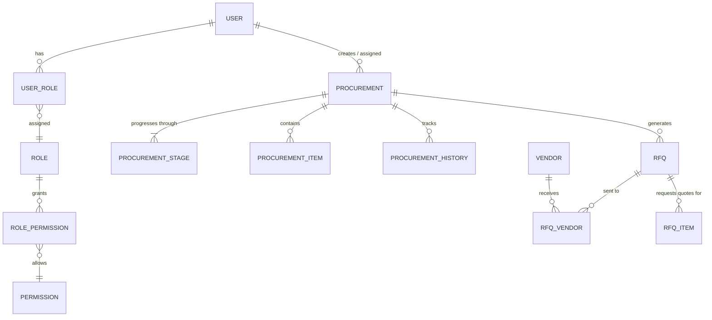

# Purpose
Documents the database architecture, schema design, relational mappings, and data flow patterns for IFH One.

# Scope
Applies to the PostgreSQL database mapped via Prisma ORM inside `apps/api/prisma/schema.prisma`.

# Last Generated
2026-06-29

# Related Documents
- [ARCHITECTURE.md](./ARCHITECTURE.md)
- [API.md](./API.md)

---

## Database Technology
- **Database Engine:** PostgreSQL
- **Hosting:** Neon (Serverless Postgres)
- **ORM:** Prisma v5

## Entity Relationship Diagram (High-Level)

## Core Models & Relationships

### 1. Security & RBAC
- **`User`**: Represents employees. Fields include `employeeId`, `email`, `departmentId`, and `status`. Heavily related to all actions as `performedBy` or `assignedTo`.
- **`Role` & `Permission`**: Mapped via `RolePermission`. Determines access levels.
- **`WorkflowStagePermission`**: Maps roles explicitly to stage numbers (1-23), defining who can `view`, `edit`, or `approve` a specific stage.
- **`Session`**: Tracks active JWT tokens and expiration.

### 2. Procurement Core
- **`Procurement`**: The central "Indent" entity. Contains metadata (`referenceNo`, `title`, `estimatedValue`, `currentStage`, `status`).
- **`ProcurementStage`**: Crucial table that tracks the status of each of the 23 workflow stages. Linked `1:N` to `Procurement`. Includes `status` (PENDING, COMPLETED, DELAYED) and `actionTaken`.
- **`ProcurementItem`**: The physical materials requested, linked to `items_db`.
- **`ProcurementHistory` & `AuditLog`**: Append-only tables tracking all actions, stage transitions, and delays.
- **`BulkOperation`** (added v1.6.0): Append-only audit record for bulk stage updates — one row per bulk run, capturing `action`, `totalSelected/Eligible/Updated/Skipped/Failed`, `remarks`, `notifyUsers`, `ipAddress`, `performedById`, `durationMs`, and a JSON `resultDetail` (per-record updated/blocked/failed breakdown). Individual record changes still create their own `ProcurementHistory` rows tagged `metadata.updateType = 'BULK_UPDATE'`; `BulkOperation` never replaces or overwrites that per-record history.
- **`ProcurementAttachment` & `ProcurementRemark`**: Files and comments tied to specific stages.

### 3. RFQ & Vendor Evaluation
- **`RFQ`**: Created from a Procurement (Indent). Contains terms and submission deadlines.
- **`RFQVendor`**: Maps multiple Vendors to a single RFQ.
- **`RFQItem`**: Copies indent items for vendor quotation.

### 4. Master Data (External DBs or Raw Tables)
- **`vendors_db`**, **`projects_db`**, **`items_db`**: Act as read-only or legacy-integrated master data tables.

### 5. Analytics & Monitoring
- **`SearchAnalytics`**: Tracks enterprise SKU search performance, queries, result counts, fuzzy fallbacks, and usage metrics across the system.

## Constraints & Referential Integrity
- **Cascading Deletes:** Prisma is configured with `onDelete: Cascade` for all child tables of `Procurement` (e.g., Stages, Items, Attachments). This ensures no orphaned records if an Indent is deleted.
- **Unique Indexes:** Enforced on `employeeId`, `email`, `sessionToken`, `referenceNo`, and composite keys like `[roleId, permissionId]`.

## Important Transaction Patterns
Stage transitions (e.g., from S1 to S2) are handled inside Prisma Transactions (`prisma.$transaction`) to guarantee that:
1. The `ProcurementStage` is updated.
2. The `Procurement`'s `currentStage` counter is incremented.
3. A `ProcurementHistory` log is appended.
If any step fails, the entire transition rolls back.

## Migrations
Database schema changes are managed strictly via Prisma Migrations (`prisma migrate dev` locally, `prisma migrate deploy` in production). Manual SQL DDL is strictly prohibited.
